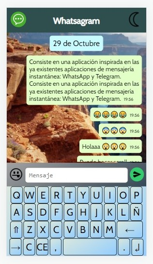
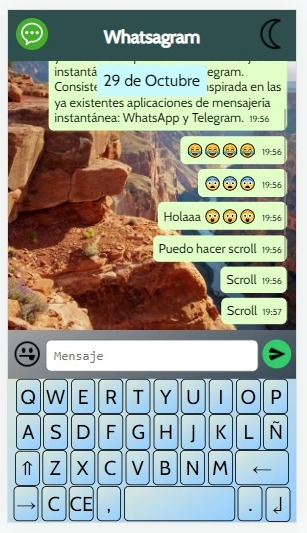
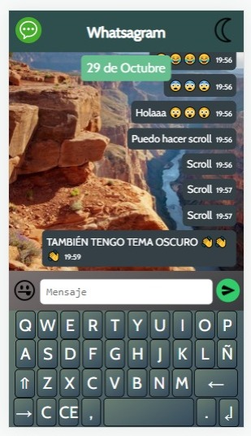
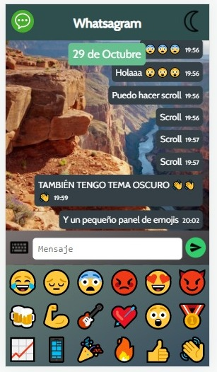

# _Proyecto P1 + PC1, para los módulos de DIW y DWEC_

## <ins>Whatsagram</ins>

#### Consiste en una aplicación inspirada en las ya existentes aplicaciones de mensajería instantánea: WhatsApp y Telegram.

> Funcionalidades

- [x] Interfaz gráfica similar a WhatsApp.
- [x] Estructura principal: encabezado, messaging area, textarea y keyboard area.
- [x] El usuario podrá escribir en la textarea mediante el teclado de Whatsagram (keyboard area) y enviar mensajes con el botón de envío situado justo a la derecha. También se puede usar el teclado real.
- [x] Los mensajes enviados aparecen en la messaging area con una fecha y hora de envío, los cuales se imprimen en un formato adecuado.
- [x] Funcionan todas las teclas principales de la keyboard area, que se basa en un teclado qwerty común.
- [x] En esta versión inicial se pueden incluir 18 emojis distintos junto al texto de los mensajes (en un mismo mensaje se pueden contener tanto emojis como letras, todos los que se deseen).
- [x] Una serie de teclas especiales:
    1. C (Borra todo el texto de textarea).
    2. CE (Borra una palabra).
    3. ← (El borrar típico, que elimina el último caracter).
    4. → (Borra al revés, elimina el primer caracter).
    5. Shift/Majus (Su comportamiento se explicará en detalle).
    6. Espacio.
    7. Salto de línea (No es funcional).
- [x] Comportamiento de Shift/Majus:
    1. Por defecto tiene un valor de 1, lo que significa que escribe la primera letra en mayúscula y automáticamente se cambia a minúsculas.
    2. Se puede cambiar su valor a 0 (todo en minúsculas) y a 2 (todo en mayúsculas).
    3. Cada vez que se envía un mensaje, su valor se resetea a 1.
    4. Se muestra visualmente el estado de la tecla Shift/Majus.
- [x] La estructura principal de la página está marcada por el grid de CSS.
- [x] La keyboard area se construye mediante flexbox.
- [x] Esta app tiene un diseño responsive y se adapta a muchos dispositivos móviles distintos (no a todos) y a la vista de escritorio.
- [x] Se muestra un pequeño efecto visual al pulsar cualquier botón de Whatsagram.
- [x] La fuente de Google Font utilizada es Cabin.
- [x] Se usan algunas variables de CSS, lo que permite una mayor mantenibilidad y cambiar de forma más rápida la interfaz si es necesario.
- [x] Extras añadidos:
    1. Se puede cambiar de tema claro a oscuro pulsando solamente un botón.
    2. Al enviar un mensaje nuevo, en caso de que toda la messaging area esté llena, se hace automáticamente scroll hasta abajo, porque de esta manera los nuevos mensajes no quedan "escondidos" esperando a que el usuario los descubra. Se puede scrollear fácilmente por todo el historial de mensajes enviados.

## <ins>Capturas</ins>

  
  

  
  

